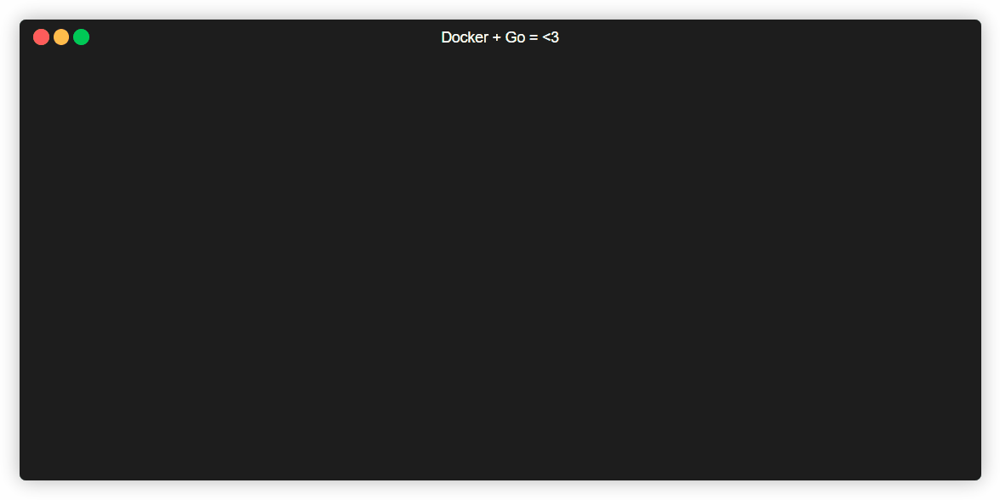

<h1 align="center">@therustycrab/go-docker-distroless-starter</h1>
<p align="center">
    
    <a href="https://github.com/features/actions" title="Go to GitHub Actions homepage"></a>
    <a href="https://www.docker.com/" title="Go to Docker homepage"></a>
    <a href="https://golang.org" title="Go to Go homepage"></a>
    <br><br>
    Welcome to <code>@therustycrab/go-docker-distroless-starter</code> 🚀<br>
    This codebase is designed to help you get started with running Dockerized Go applications.
</p>



## Features

- [x] Multistage Dockerfile using [Google Distroless](https://github.com/GoogleContainerTools/distroless) image for optimal build image size (**~25MB** in this example!)
- [x] Docker-compose file for easy container deployment
- [x] [Echo](https://github.com/labstack/echo) as an example of a simple HTTP server built with Go
- [x] GitHub Actions for continuous integration and delivery

## Requirements

Before getting started, make sure you have the following requirements installed on your system:

- Go
- Docker
- Docker Compose

## Installation

To build and run the server, follow these steps:

1. Clone this repository:

   ```shell
   $ git clone https://github.com/therustycrab/go-docker-distroless-starter.git
   ```

2. Change to the project directory:

   ```shell
   $ cd go-docker-distroless-starter
   ```

3. Download the Go module dependencies:

   ```shell
   $ go mod download && go mod verify
   ```

4. Build and start the server using Docker Compose:

   ```shell
   $ docker compose up --build -d
   ```

   This command will build the Docker image and start the server in detached mode (`-d`). The server will be accessible at `http://localhost:8080`.

4. You're all set! The server is now up and running.

## Configuration

By default, the server listens on port 8080. If you want to change the port or any other configuration, you can modify the `docker-compose.yml` file in the project root.

## Usage

Once the server is running, you can access it by navigating to `http://localhost:8080` in your web browser or using tools like cURL or Postman.

## Contributing

Contributions are welcome! If you'd like to contribute to this project, please follow these steps:

1. Fork the repository.
2. Create a new branch for your feature or bug fix.
3. Make your changes and commit them.
4. Push your changes to your fork.
5. Submit a pull request.

Please make sure to follow the existing code style and write appropriate tests for your changes.

## License

This project is licensed under the [Apache License](LICENSE).

---

Thank you for using `@therustycrab/go-docker-distroless-starter`! If you have any questions or need further assistance, please don't hesitate to reach out.
